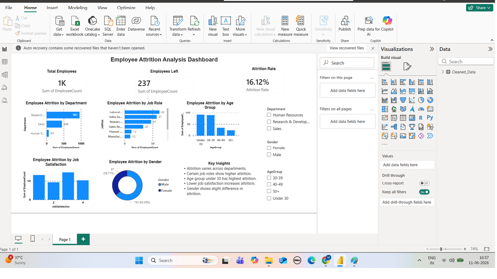

# HR Analytics Dashboard

##  Project Overview
This project is an HR Analytics Dashboard built using Excel and Power BI.  
It helps analyze employee data to understand attrition, department trends, and workforce distribution.

---

##  Tools Used
- Excel (Data Cleaning)
- Power BI (Data Visualization)

---

##  Project Files
- data/hr_dataset.xlsx → Raw dataset
- powerbi/hr_dashboard.pbix → Power BI dashboard file
- images/dashboard.png → Dashboard screenshot

---

## Key Insights
- Attrition trends identified across departments and employee groups.
- Workforce distribution analyzed by age, gender, and department.
- Salary and tenure factors evaluated for their impact on retention.
- Key areas for improving employee retention highlighted.
- Interactive dashboard created for HR decision-making.
---

##  Dashboard Preview

---

##  Objective
To transform raw HR data into meaningful insights that help in better decision-making for HR management.

---

## 👩‍💻 Author
Meenal Upadhyay
